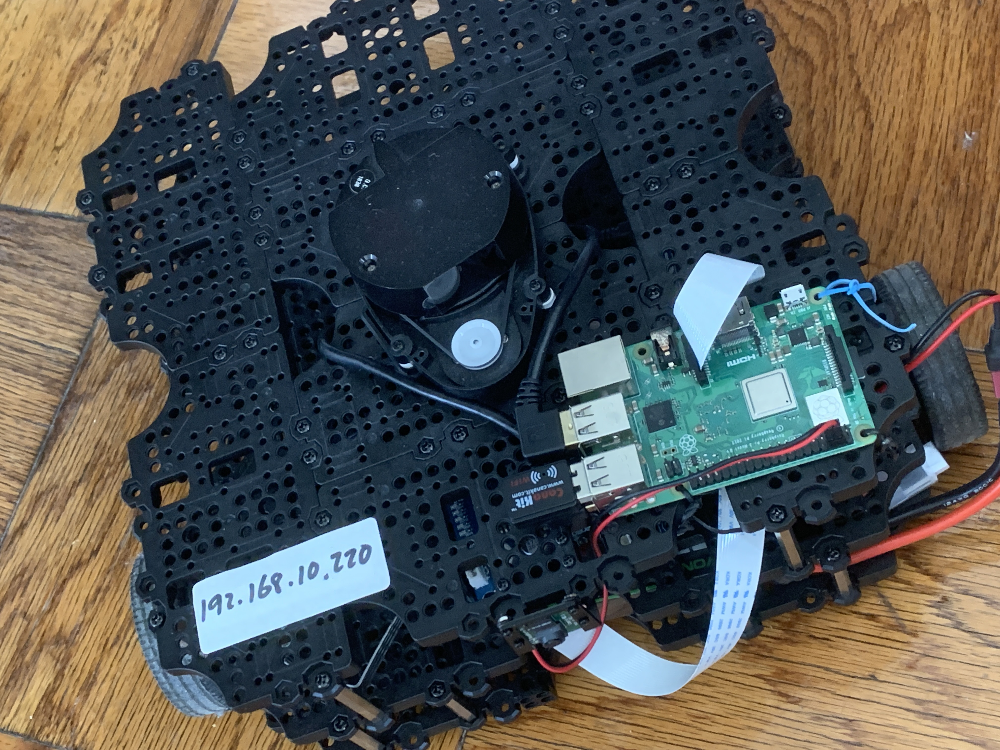

<h1 align="center"><p>Robot System Programming</p><p>VOT-Pro</p><p> Prototype for Vision-based Object-tracking Turtlebot</p></h1>

### Contributors

#### Created and Maintained by:  

 - [Jiaming Zhang](https://github.com/jeremyzz830): JHED ID : jzhan282  

 - [Yixun 'Daniel' Wang](https://github.com/DanielW1112): JHED ID : ywang317  

 - [Tianyi Weng](https://github.com/WengTianyi): JHED ID : tweng1  

<h4 align="right">
<p>May 13rd 2022</p>
<p>@ Johns Hopkins University</p> 
</h4>


# Table of Content

[Introduction](#Introduction)

[TurtleBot Configuration](#TurtleBot-Configuration)

[Remote PC Configuration](#Remote-PC-Configuration)

[Running Tutorial](#Running-Tutorial)


# Introduction

This repository storing the packages that are used on the real robot.

The prototype part mainly focus on how to actually "drive" the turtlebot. It contains a bunch of steps that are necessary to configure the raspberry pi and all the other hardwares. Therefore, two separate section are included in this repo.


&nbsp;

# I. TurtleBot Configuration

Our project is based on [TurtleBot3 Waffle Pi](https://emanual.robotis.com/docs/en/platform/turtlebot3/overview/), which is a two-wheel driven holonomic platform controlled by OPENCR, a 32-bit special designed arduino. Raspberry Pi works as the upper layer to run a fully functional OS.

As for the sensor aspect, odometry and gyroscope are embedded in the motor and OPENCR. LiDar and Raspi-Camera are attached on the top of the turtlebot and are connected directly to the raspberry pi.

Generally, Raspberry Pi only transmits the data and control commands as a "slave". The remote PC acts as a ROS master who process the data and publish the control inputs. This setting indicates we need two Linux computer, one is for Raspberry Pi and another is for remote PC. The configuration for these two computers will be introduced in the following section separately.

&nbsp;

## 1.1 System Setting for Raspberry Pi

**1) Install Linux based on Raspbian**

This part will briefly introduce how to install a Raspbian based system on the Raspberry Pi.

**WARNING**: The SDcard should have at least 8 GB of empty space in order to install Linux on Raspberry Pi 3.

We provide the Linux distro image based on Raspbian. They are pre-installed with ROS and ROS-packages related TurtleBot3. It supports the TurtleBot3 Burger and Waffle Pi model. In this distro image, non-free software like Wolfram, Mathematica, Minecraft Pi and Oracle Java SE are removed.

 - **Step 1: On Remote PC**
    Download the Linux distro image based on Raspbian for TurtleBot3
    [download link](https://www.robotis.com/service/download.php?no=1738)
    SHA256: 7a868c275169b1f02c04617cc0cce9654fd8222623c78b22d0a27c73a9609398
    After download, unzip the downloaded file. 

    Guide to burn the image to SD card
    Visit etcher.io and download and install the Etcher SD card image utility.
    Run Etcher and select the Linux image you downloaded on your computer or laptop.
    Select the SD card drive.
    Click Burn to transfer the image to the SD card.
    (other methods to burn) You can use ‘dd’ command in Linux or use application ‘win32 Disk Imager’ in Windows. For a complete guide, 	take a look here (for Linux users) and here (for Windows users)
    &nbsp;

 - **Step 2: On TurtleBot PC**
    After the installation, you can login with username pi and password turtlebot. In this case, you have to connect your Raspberry Pi to 	your monitor using an HDMI cable, and connect your keyboard and mouse to the Raspberry Pi.

    Expand filesystem to use a whole SD card.
```bash
sudo raspi-config
#(select 7 Advanced Options > A1 Expand Filesystem)
```


- **Step 3: Guide to connecting to a wireless network**
    Synchronize and set computers’ date and time by querying a Network Time Protocol (NTP) server
```bash
  sudo apt-get install ntpdate
  sudo ntpdate ntp.ubuntu.com
  
  # If you want to change the Password, Locale and Timezone setting (Optional):
  sudo raspi-config > 1 Change User Password
  sudo raspi-config > 4 Localisation Options > I1 Change Locale
  sudo raspi-config > 4 Localisation Options > I2 Change Timezone
  
  # Network configuration for ROS (reference link)
  nano ~/.bashrc
  (modify `localhost` to REMOTE_PC_IP and RASPBERRY_PI_3_IP)
  
  export ROS_MASTER_URI=http://REMOTE_PC_IP:11311
  export ROS_HOSTNAME=RASPBERRY_PI_3_IP
  source ~/.bashrc
```

 - **Step 4: Access to Turtlebot from Remote PC**
	Once you’re done the wireless configuration, you can connect to Raspberry Pi via SSH from your desktop or laptop (reference link): ssh pi@192.168.xxx.xxx (The IP 192.168.xxx.xxx is your Raspberry Pi's IP or hostname)

NOTE: Differences from the official Raspbian Stretch

It's based on Raspbian Stretch with desktop, the Raspbian based on Debian Stretch  
Removed non-free software like Wolfram, Mathematica, Minecraft Pi and Oracle Java SE  
Removed libreoffice to reduce image size  
Enabled SSH and Camera function using raspi-config  
Change the password: turtlebot  
Installed software for ROS and TurtleBot3 ROS Kinetic Kame and dependency software raspicam_node package for Raspberry Pi Camera, hls_lfcd_lds_driver package for Laser Distance Sensor, turtlebot3 and turtlebot3_msgs packages for TutleBot3  
Installed ROS Packages (132 packages): actionlib, actionlib_msgs, angles, bond, bond_core, bondcpp, bondpy, camera_calibration_parsers, camera_info_manager, catkin, class_loader, cmake_modules, collada_parser, collada_urdf, common_msgs, compressed_image_transport, control_msgs, cpp_common, cv_bridge, diagnostic_aggregator, diagnostic_analysis, diagnostic_common_diagnostics, diagnostic_msgs, diagnostic_updater, diagnostics, dynamic_reconfigure, eigen_conversions, eigen_stl_containers, executive_smach, filters, gencpp, geneus, genlisp, genmsg, gennodejs, genpy, geometric_shapes, geometry, geometry_msgs, hls_lfcd_lds_driver, image_transport, joint_state_publisher, kdl_conversions, kdl_parser, message_filters, message_generation, message_runtime, mk, nav_msgs, nodelet, nodelet_core, nodelet_topic_tools, octomap (plain cmake), opencv3 (plain cmake), orocos_kdl (plain cmake), pluginlib, python_orocos_kdl (plain cmake), python_qt_binding, random_numbers, raspicam_node, resource_retriever, robot, robot_model, robot_state_publisher, ros, ros_base, ros_comm, ros_core, rosbag, rosbag_migration_rule, rosbag_storage, rosbash, rosboost_cfg, rosbuild, rosclean, rosconsole, rosconsole_bridge, roscpp, roscpp_core, roscpp_serialization, roscpp_traits, roscreate, rosgraph, rosgraph_msgs, roslang, roslaunch, roslib, roslint, roslisp, roslz4, rosmake, rosmaster, rosmsg, rosnode, rosout, rospack, rosparam, rospy, rosserial_msgs, rosserial_python, rosservice, rostest, rostime, rostopic, rosunit, roswtf, self_test, sensor_msgs, shape_msgs, smach, smach_msgs, smach_ros, smclib, std_msgs, std_srvs, stereo_msgs, tf, tf_conversions, tf2, tf2_kdl, tf2_msgs, tf2_py, tf2_ros, topic_tools, trajectory_msgs, turtlebot3_bringup, turtlebot3_msgs, urdf, urdf_parser_plugin, visualization_msgs, xacro, xmlrpcpp

&nbsp;

Take it easy if you have other version of ROS distros on your remote PC because they only cooperate through rostopics and as long as the message type are the same, the communications can be established.

&nbsp;

## 1.2 Hardware Assembly

To make everything work, the hardwares need to be connected correctly as following:



- LiDar connects to the Raspberry Pi through USB port.
- OPENCR connects to the Raspberry Pi through USB port.
- Raspi Camera connects to the Raspberry Pi through video serial port.
- The Raspberry Pi is powered by the OPENCR through GPIO pin #4 and #6 [Raspi GPIO](pinout.xyz)

&nbsp;

# II. Remote PC Configuration

## 2.1 System Setting

### Ubuntu

This repo is created under Ubuntu 18.04LLTS Bionic Beaver with ROS Melodic.
&nbsp;

ROS required package

First, our project depends on several packages, install them before you pull this repo.

```bash
$ sudo apt-get install ros-melodic-timed-roslaunch
$ sudo apt-get install ros-melodic-dwa-local-planner
$ sudo apt-get install ros-melodic-gmapping
```

You can ignore this if you have already installed these packages.
&nbsp;

### Modify bashrc

```bash
$ echo 'export turtlebot_model=waffle_pi' >> ~/.bashrc 
$ source ~/.bashrc
```

Note: "source ~/.bashrc" needs to be run everytime a new terminal window is opened.

&nbsp;

## 2.2 Installation

### git clone this repo

Create an empty workspace before start:

```bash
$ mkdir -p ~/vot_ws/prototype/src
```

Get into this directory and clone this repo

```bash
$ cd ~/vot_ws/prototype/src
$ git clone https://github.com/jeremyzz830/RSP-Project-VOT-Pro.git
```

### build the repo

```bash
$ cd ~/vot_ws/prototype
$ catkin build 
```

### rosdep

```bash
$ rosdep install --from-paths src --ignore-src -r -y
```

&nbsp;&nbsp;

&nbsp;

# III. Running Tutorial

This part is quite tricky because you need to launch several launch files sequentially both on turtlebot and remote pc. But before everything starts, a camera calibration process has to be performed.

## Camera Calibration

( On raspberry pi ) Launch the raspi camera and have it publish the images through rostopic.

```bash
$ roslaunch raspicam_node camerav2_1280x960.launch enable_raw:=true
```

And the prepare a checker board like this: [checker board source file](https://raw.githubusercontent.com/MarkHedleyJones/markhedleyjones.github.io/master/media/calibration-checkerboard-collection/Checkerboard-A4-25mm-8x6.pdf)

( On remote PC ) Open a new terminal and run the calibration node.

```bash
$ rosrun camera_calibration cameracalibrator.py --size 8x6 --square 0.25 image:=/raspicam/image camera:=/raspicam --no-service-check
```

For detailed operations, refer to this [link](wiki.ros.org/camera_calibration)


## Workflow

### Step1 :

In first terminal:

```bash
$ ssh pi@{IP of Pi} 
$ roslaunch turtlebot3_bringup turtlebot3_robot.launch
```
In second terminal:

```bash
$ roslaunch raspicam_node camerav2_1280x960.launch enable_raw:=true
```

In third terminal

```bash
$ roslaunch prototype_manager slam.launch
```

This command will start the SLAM process with autonomous driving for the robot.  

### Step2 :  

Once the map is complete, use the dynamic reconfigure GUI and switch the “Switch_to_Navigation” button from “NO” to “YES”. This will then trigger a shutdown sequence that automatically saves the map (into the Downloads folder) and terminates the node. Use “ctrl C” to shut down any remaining node.

### Step3 ：  

```bash
$ roslaunch prototype_nav nav_prototype.launch
```

This launch file will start several features.  

1. Start RVIZ and launch with the map saved in the previous step.  
2. Start an initializing node, “nav_prototype_init_node”, for placing the robot in the simulation world in preparation for 2D Navigation.  
4. Start “find_circle”. This node publishes navigation goals to “ball_position” Topic in geometry_msgs/Point. The node also subscribes to the “move_base/result” Topic to monitor the results of robot’s actions.  

As the goals are published, the “nav_prototype_init_node” subscribes to the topic and transcribes the goal as a geometry_msgs/PoseStamped message to publish to the “/move_base_simple/goal”.  

&nbsp;


# IV. Demo

We've distributed the whole project on Turtlebot3-Waffle_pi. The demo on the prototype has been posted here:

[https://drive.google.com/drive/folders/1RP03UFPCJpnJTt2jAu6Q22l8seSf-LJy](https://drive.google.com/drive/folders/1RP03UFPCJpnJTt2jAu6Q22l8seSf-LJy)

